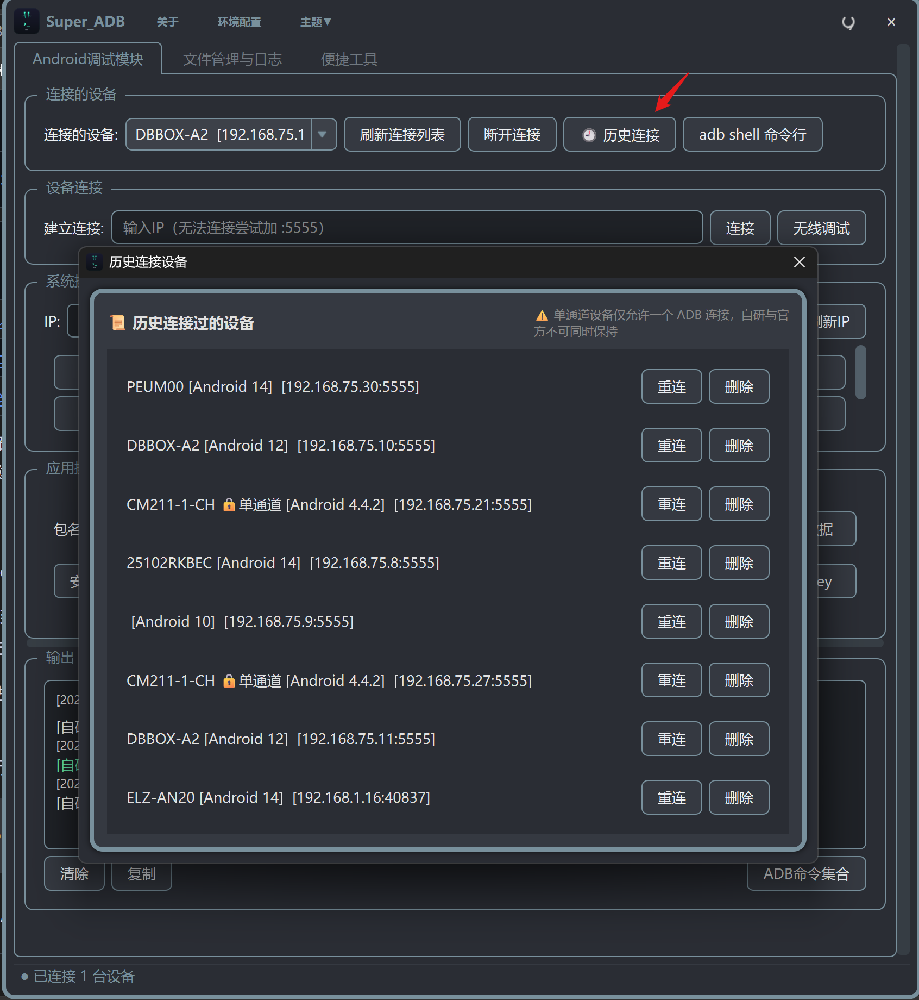
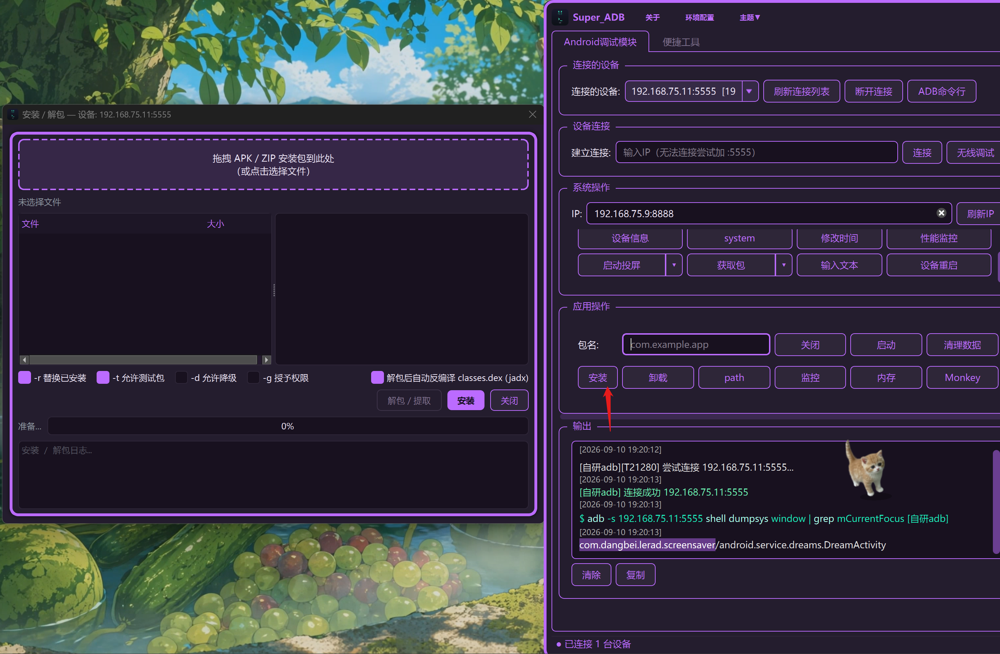
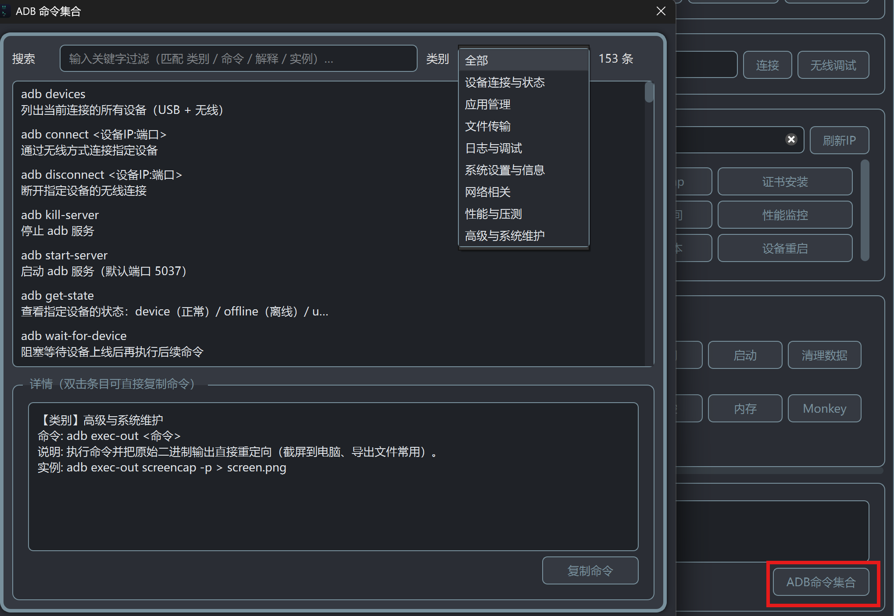

# Super_ADB

> 跨平台 ADB 集成调试工具，集设备连接、应用管理、文件传输、日志抓取、性能监控、网络抓包、投屏控制、ADB 命令速查等功能于一体。

[](#️-支持平台)
[](#-快速开始)
[](#-功能特性)
[](#-许可证)
[](#-下载安装)
[](https://github.com/Jcs2026-byte/Super_ADB/releases)
[](https://github.com/Jcs2026-byte/Super_ADB/releases)
[](https://github.com/Jcs2026-byte/Super_ADB/stargazers)
[](https://github.com/Jcs2026-byte/Super_ADB/commits)

[](pyproject.toml)
[](#-下载安装)
[](#-功能特性)
[](#-多主题切换)
[](#-adb-命令集合)
[](#-贡献)
[](#-快速开始)
[](https://gitee.com/Jcs2026/Super_ADB/stargazers)
[](https://gitee.com/Jcs2026/Super_ADB/forks)
[](https://gitcode.com/Jcs2026/Super_ADB/stargazers)

---

## 目录

- [✨ 功能特性](#-功能特性)
- [🚀 快速开始](#-快速开始)
- [📥 下载安装](#-下载安装)
- [🖥️ 支持平台](#️-支持平台)
- [📁 项目结构](#-项目结构)
- [📖 文档](#-文档)
- [🔗 开源地址](#-开源地址)
- [🤝 贡献](#-贡献)
- [📜 许可证](#-许可证)
- [📢 联系方式](#-联系方式)

---

## ✨ 功能特性

### 🔌 设备连接


- **自研 ADB 协议栈（三平台默认）**：纯 Python 实现，TCP 直连 + USB（pyusb）双通道，不依赖官方 adb server、不占用 5037 端口，传输速度最高可达官方 2.7 倍
- **智能设备列表**：默认只显示已连接设备（USB + 已认证），与官方 `adb devices` 行为一致；需要扫描局域网可使用独立的「IP 扫描」功能
- **系统 ADB / Socket 直连**：可一键切换回官方 adb（优先 PATH，其次内置 platform-tools）
- **无线调试**：局域网扫描、配对码连接（adb pair）、二维码连接（mDNS）三种方式
- **历史连接设备**：自动记录连接过的设备（IP/端口/型号/系统版本），一键重连/删除，按型号自动识别单通道设备
- 本地起服务接受设备端广播授权，首次连接需在设备端确认，软件不会连接互联网



- **自动记录**：每次连接成功后自动保存设备信息（IP、端口、型号、Android 版本），无需手动添加
- **一键重连**：点击历史记录即可快速连接常用设备，无需每次输入 IP
- **智能识别**：按设备型号自动识别单通道设备（如 IPTV 盒子），连接时自动适配
- **管理方便**：支持删除不需要的历史记录，自动去重

### 📁 文件管理


- 设备文件树浏览器，支持上传/下载/删除/重命名/移动/新建目录/新建文件
- 拖拽上传、深度递归搜索、文本/图片/视频预览
- 双击文本文件在线编辑，保存后自动回传设备（缓存到桌面 `Super_ADB/文件缓存/`）
- 权限修改（右键授权 777），只读分区自动检测并附解锁引导
- 深度搜索结果支持右键"打开所在路径"，自动定位并展开到目标目录
- 切换模式时自动停止正在进行的文件管理/日志任务

### 📦 应用管理



- APK 拖拽安装、批量安装、实时进度显示
- APK 元信息解析（包名/版本/权限/四大组件），解包查看资源
- 安装失败自动诊断原因
- **包信息获取**：一键查看指定包的安装路径、PID、版本号、UID、数据目录、应用大小等详细信息
- **冻结 / 解冻应用**：输入包名一键冻结（`pm disable`）或解冻（`pm enable`），自动查询校验结果，自研 / 系统 ADB 模式均兼容

### 📋 日志抓取


抓取设备全部日志保存到桌面文件夹，动态加载展示到日志查看器（过滤仅影响展示，不影响落盘）。

- 多标签 logcat 查看器，实时流式输出
- 关键字过滤（支持正则）、日志级别筛选、星标标记
- 多设备同时监控，日志导出保存
- 17 套主题自适应，级别颜色随主题切换保证高对比度

### 💻 ADB 交互式终端


进入的是 adb shell（非 cmd 命令行），部分 cmd 命令不适用，需替换为 shell 对应命令。例如 `findstr` 需改为 `grep`；发送 `adb shell pm dump ...` 会自动去掉前缀转为 shell 命令。

- 自研 ADB 协议栈驱动，支持 TCP + USB 双通道
- 命令历史（上下箭头）、Ctrl+C / Ctrl+D、清屏
- **常用命令快捷按钮**：自定义常用命令，点击自动填充，支持增删改查、持久化保存
- ANSI 转义序列过滤，终端样式随主题切换

### 📖 ADB 命令集合



- 输出区「ADB命令集合」按钮，一键弹出命令速查窗口
- 内置 **150+ 条 ADB 命令**（8 大分类：设备连接、应用管理、文件传输、日志调试、系统设置、网络、性能压测、高级维护），覆盖 adb 客户端命令与 shell 端常用工具
- 每条命令含「命令 / 说明 / 实例」，类别筛选 + 关键字搜索，一键复制
- 弹窗样式与主界面主题联动，三平台同步

### 📊 性能监控

- 设备级：CPU 多核分核/内存/温度/FPS/网络速率
- 应用级：12 项图表指标、内存泄漏自动检测、ANR/OOM 检测、hprof 自动抓取
- HTML 报告导出，数据实时刷新

### 🌐 网络抓包


- **tcpdump**：自动检测架构并推送二进制（arm64/arm），root 设备自动推送；BPF 过滤器、实时包数统计、pcap 自动拉取
- **代理抓包**：配合 Charles 等工具，一键设置/取消设备代理（默认指向电脑 8888 端口）
- **证书安装**：将抓包软件证书编译为设备格式并推送至系统，实现 HTTPS 抓包（需 root）

#### PCAP 解析器


- 支持拖拽 pcap 文件直接解析，无需打开 Wireshark
- **协议识别**：自动识别 HTTP/HTTPS/TCP/UDP/DNS/ICMP 等常见协议
- **流重组**：TCP 流自动重组，完整还原 HTTP 请求/响应
- **包列表**：时间、源/目的 IP、端口、协议、长度、概要信息
- **包详情**：十六进制 + ASCII 双视图，协议字段逐层展开
- **搜索过滤**：按关键字、IP、端口、协议快速定位包

### 📺 scrcpy 投屏

- 低延迟投屏，键鼠反向控制
- 智能识别单通道/多通道设备，单通道设备自动切换官方通道，不抢自研连接
- 分辨率/码率/帧率/编码器/渲染驱动自定义
- 文件拖拽传输、屏幕录制

### 🛠️ 便捷工具集


- **JSON 工具**：格式化/差异对比/YAML 互转/Schema 校验，支持左右拖放 .json 文件对比，导出 HTML 差异报告
- **URL 编解码**：UTF-8 百分号编码 / 解码
- **哈希校验**：8 种算法，支持 Windows 右键菜单
- 时间戳转换、修改系统时间、设备信息、证书安装、环境配置

### ⌨️ 系统截图与录屏

- **本软件截图**：框选区域后弹出预览工具条，支持矩形/椭圆/箭头/文字标注（可拖动、缩放、改色、撤销），保存/复制到剪贴板；自动保存到桌面 `Super_ADB/截图/`，可自定义全局热键
- **系统截图工具**：自动检测 Win+Shift+S 可用性，显示系统保存位置
- **录屏**：使用系统自带 Game Bar（Win+Alt+R），自动检测可用性并显示保存位置
- Windows 使用 RegisterHotKey（无需管理员），macOS 用 PyObjC，Linux 用 python-xlib

### 🐒 Monkey 压测


- 命令模板自定义、停止控制、崩溃自动拉取报告
- 实时事件饼图统计、事件回放（支持自研/官方双模式）

- 搭配应用监控获取性能情况，导出 HTML 报告到桌面

### 🎨 多主题切换

共 **17 套主题**，包含浅色（晴空/薄荷/樱花/薰衣草/暖阳/冰川）、深色（青绿/青蓝/紫/琥珀/深红/霓虹）、简约（纯黑/灰/iOS/蓝）等风格，跟随系统记忆选择，所有控件与输出区文字颜色随主题自适应。

---

## 🚀 快速开始

### 环境要求

- Python 3.12+（代码使用了 3.12 的 f-string 反斜杠语法）
- 依赖见 [requirements.txt](requirements.txt)

### 源码运行

```bash
# 克隆仓库
git clone https://github.com/Jcs2026-byte/Super_ADB.git
cd Super_ADB

# 安装依赖
pip install -r requirements.txt

# 运行（三平台任选其一）
# Windows
cd Super_ADB_Win && python 项目启动入口/Super_ADB_主入口.py
# macOS
cd Super_ADB_MAC && python 项目启动入口/Super_ADB_主入口.py
# Linux
cd Super_ADB_Linux && python 项目启动入口/Super_ADB_主入口.py
```

---

## 📥 下载安装

三平台安装包由 CI（打标签后）自动构建发布，提供三个下载渠道：

| 渠道 | 地址 | 说明 |
|------|------|------|
| **GitCode** | https://gitcode.com/Jcs2026/Super_ADB/releases | 国内镜像，支持大文件 |
| **GitHub** | https://github.com/Jcs2026-byte/Super_ADB/releases | CI 自动打包 |
| **Gitee** | https://gitee.com/Jcs2026/super_adb/releases | Linux 包可能不同步 |

> CI 打的包会被标记网络来源（未购买代码签名），第一次运行会提示未知警告，点击"允许"即可。本地打的包不会触发此警告。解压后放到任意目录，右键创建快捷方式到桌面即可。

### macOS 放行说明

CI 打的包未做 Apple 签名和公证，Gatekeeper 默认拦截。三种放行方式任选其一：

**方法 1：右键打开（最快）**
在 Finder 中找到 `Super_ADB_MAC.app`，按住 Control 点击（或右键）→ 打开，弹窗中再点一次"打开"。之后该 app 被记住，可直接双击运行。

**方法 2：系统设置放行**
弹窗点"完成"后，进入 系统设置 → 隐私与安全性 → 拉到最底部，看到"已阻止使用 Super_ADB_MAC…" → 点"仍要打开"。

**方法 3：命令行去除隔离属性**
打开终端执行（将路径替换为实际 app 位置）：

```bash
xattr -dr com.apple.quarantine /Applications/Super_ADB_MAC.app
```

> 从 dmg 直接运行的，请先将 app 拖到"应用程序"文件夹再执行上述命令。

---

## 🖥️ 支持平台

| 平台 | 源码目录 | 状态 | 安装包产物 |
|------|----------|------|------------|
| Windows x64 | `Super_ADB_Win/` | ✅ 完整支持 | `Super_ADB-windows-x64.zip` |
| macOS arm64 | `Super_ADB_MAC/` | ✅ 完整支持 | `Super_ADB-macos-arm64.zip` |
| Linux x86_64 | `Super_ADB_Linux/` | ✅ 完整支持 | `Super_ADB-linux-x86_64.tar.gz` |

---

## 📁 项目结构

```
Super_ADB/
├── Super_ADB_Win/          # Windows 平台源码
├── Super_ADB_MAC/          # macOS 平台源码
├── Super_ADB_Linux/        # Linux 平台源码
├── ui/                     # 通用 UI 资源（.ui 设计文件 / 图标 / 编译脚本）
├── docs/                   # 文档与截图
└── .github/                # CI 工作流与打包脚本
```

三平台目录结构一致，以 `Super_ADB_Win` 为例：

```
├── 工具/
│   ├── android调试工具/     # ADB 工具、自研adb协议栈、性能监控、APK/AXML/DEX 解析
│   ├── 便捷工具/           # JSON 读写、WiFi 工具、PCAP 解析
│   └── 配置/               # 运行时配置（ADB 模式等）
├── 对话框/                 # 各功能对话框（ADB终端、命令集合、TCPDump 等）
├── 页面/                   # 主界面页面组件
├── 项目UI/                 # 主界面样式与主题系统
├── 项目启动入口/            # 程序入口（Super_ADB_主入口.py）
├── 外部扩展/               # adb / scrcpy / tcpdump 二进制
├── 打包/                   # PyInstaller spec / 构建脚本
├── 脚本/                   # 辅助脚本
├── 诊断/                   # 诊断工具（仅 Windows）
├── 资源/                   # 图标、公众号图等
└── 配置/                   # 顶层运行时配置（仅 Windows）
```

---

## 📖 文档

- [更新日志](CHANGELOG.md) — 各版本变更记录
- [打包说明](Super_ADB_Linux/打包/README.md) — 三平台打包方法（PyInstaller / build_linux.sh）
- [贡献指南](CONTRIBUTING.md)

---

## 🔗 开源地址

- **GitHub**：https://github.com/Jcs2026-byte/Super_ADB.git
- **Gitee**：https://gitee.com/Jcs2026/Super_ADB.git
- **GitCode**：https://gitcode.com/Jcs2026/Super_ADB.git

---

## 🤝 贡献

欢迎提交 Issue 和 Pull Request！请先阅读 [贡献指南](CONTRIBUTING.md)。

---

## 📜 许可证

本项目基于 [MIT License](LICENSE) 开源。

---

## 📢 联系方式

微信:KFC-V-M-50-a

