# Super_ADB

> 一款跨平台的 ADB 集成调试工具，集设备连接、应用管理、文件传输、日志抓取、性能监控、网络抓包等功能于一体。

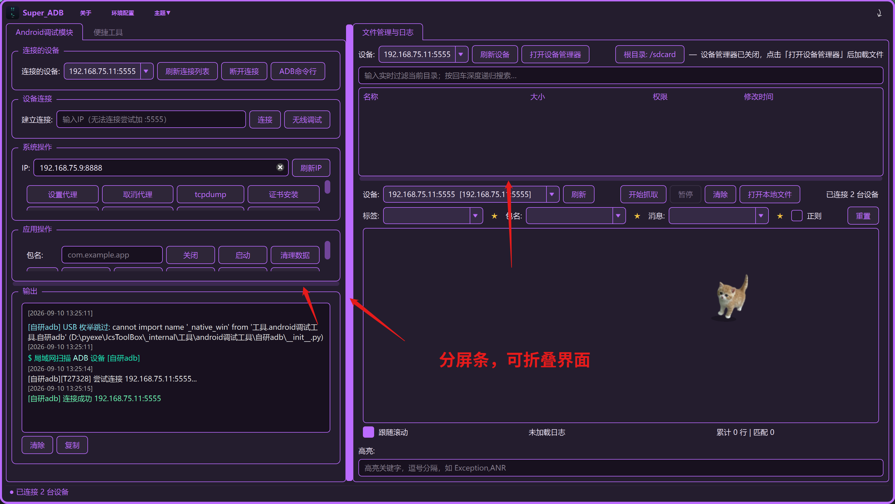
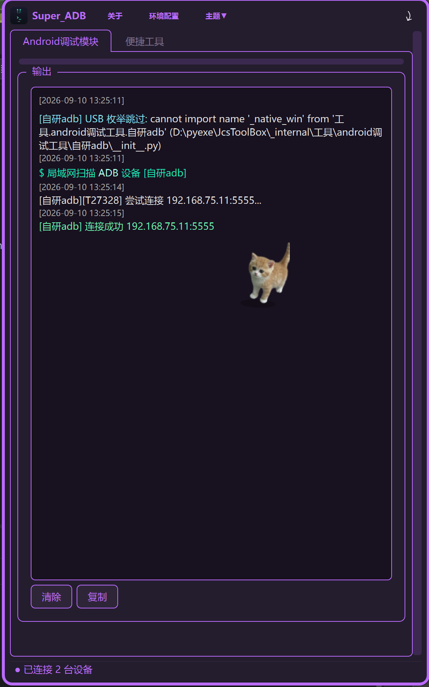
- 这三个分页条都可以折叠界面，折叠后调整窗口大小隐藏不需要的功能，下次需要的时候再展开
- **最新版本：`2026.09.13.02`**（GitHub / Gitee 均已同步）

## ✨ 功能特性

### 🔌 设备连接
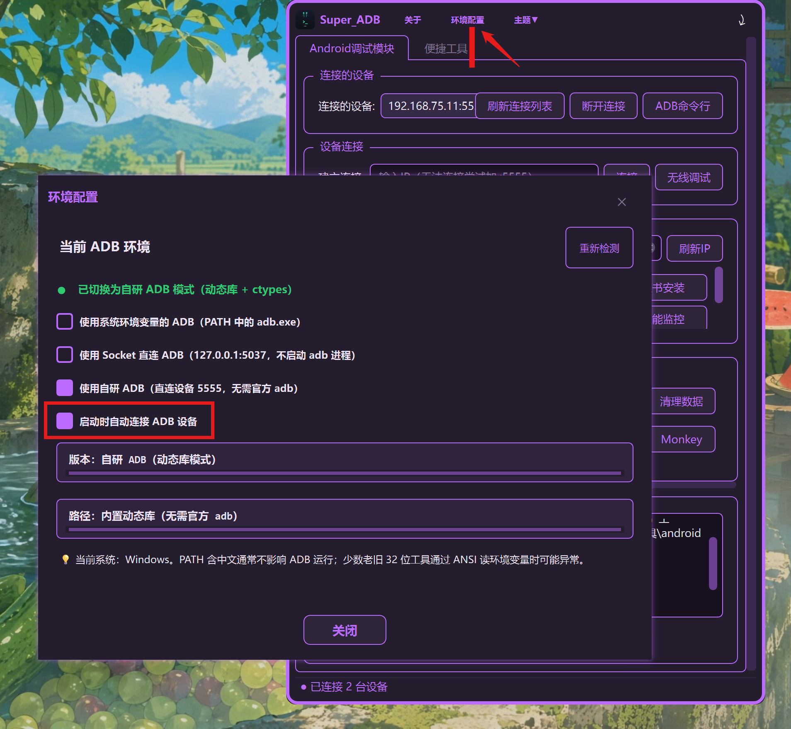
- **自研 ADB（三平台默认）**：纯 Python 实现的 ADB 协议栈（`工具/android调试工具/自研adb/`），
  TCP 直连 + USB（pyusb）双通道，不依赖官方 adb server、不占用 5037 端口，
  传输速度最高可达官方 2.7 倍
- **智能设备列表**：默认只显示已连接设备（USB + 已认证连接），与官方 `adb devices` 行为一致，
  不会自动扫描局域网影响他人设备；需要扫描局域网可使用独立的「IP 扫描」功能
- **系统 ADB / Socket 直连**：可一键切换回官方 adb（优先 PATH，其次内置 platform-tools）
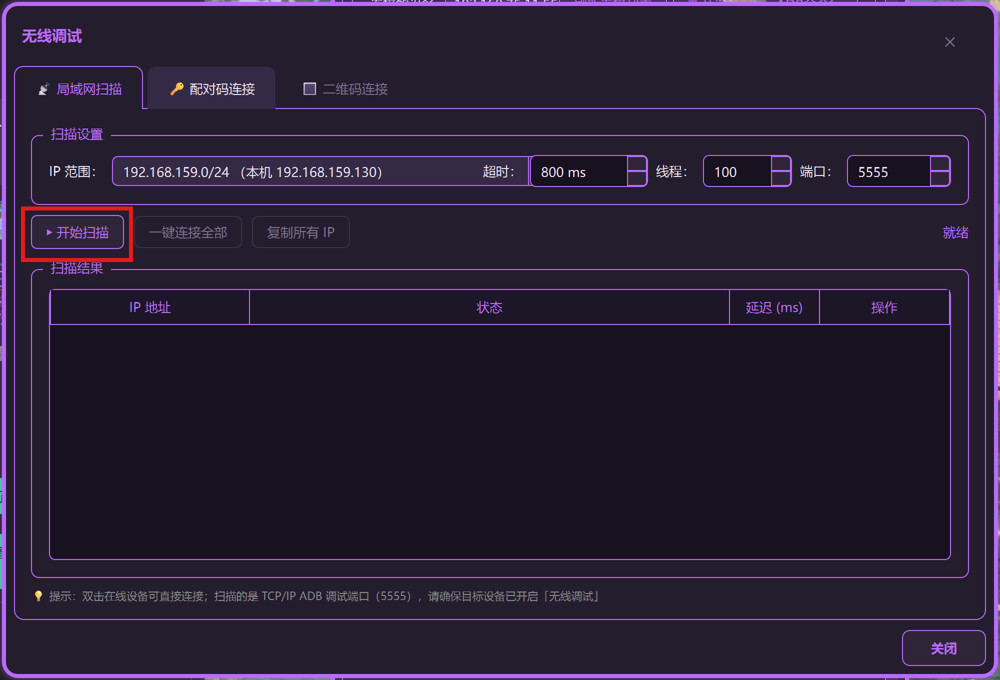
- **无线调试**：局域网扫描、配对码连接（adb pair）、二维码连接（mDNS）三种方式
- **历史连接设备**：自动记录连接过的设备（IP/端口/型号/系统版本），一键重连/删除，按型号自动识别单通道设备，不重复检测
- （会在本地起一个服务接受设备端广播发来的授权信息，首次PC端会要求授权，本软件不会连接互联网）
- 环境勾选自研adb，命令行工具会使用自研adbshell
- 非自研调用pc系统交互式输入框

### 📁 文件管理
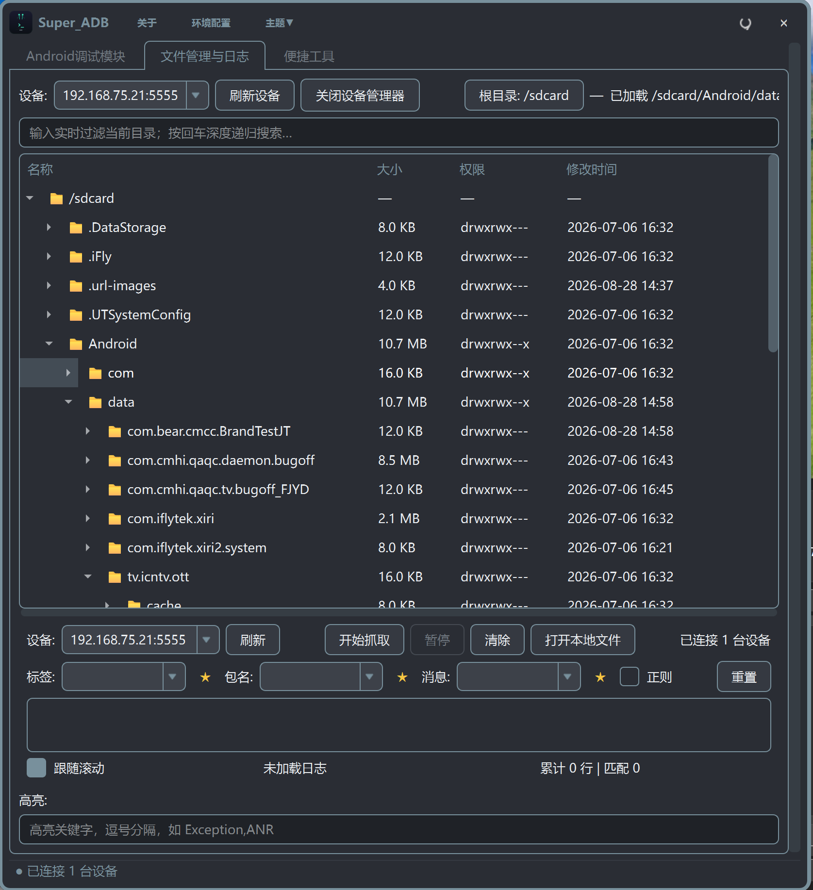
- 连接设备后单击开启设备管理器，3秒动态刷新当前目录
- 设备文件树浏览器，支持上传/下载/删除/重命名/移动/新建目录/新建文件
- 拖拽上传、深度递归搜索、文本/图片/视频预览
- 双击文本文件直接在线编辑，保存后自动回传设备（缓存到桌面 Super_ADB/文件缓存/）
- 权限修改（右键授权 777），只读分区自动检测并附解锁引导
- 深度搜索结果支持右键"打开所在路径"，自动定位并展开到目标目录
- 切换模式时自动停止正在进行的文件管理/日志任务

### 📦 应用管理

- APK 拖拽安装、批量安装、实时进度显示
- APK 元信息解析（包名/版本/权限/四大组件）
- 解包查看资源，安装失败自动诊断原因
- **包信息获取**：一键查看指定包的安装路径、PID、版本号、版本名、SDK 版本、UID、数据目录、应用大小等详细信息，异步加载不卡界面

### 📋 日志抓取
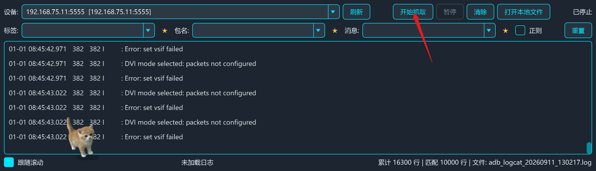
此功能是抓取设备全部日志保存到桌面文件夹内，然后动态加载一定数据展示到日志展示框，(过滤只是过滤展示) 
- 多标签 logcat 查看器，实时流式输出
- 关键字过滤（支持正则）、日志级别筛选、星标标记
- 多设备同时监控，日志导出保存

### 💻 ADB 交互式终端
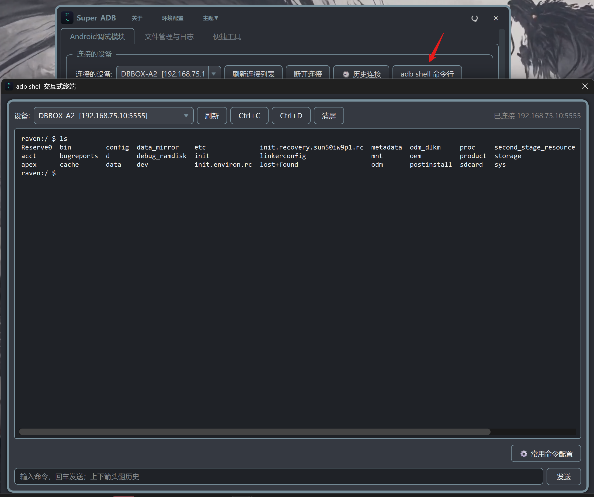
注意  这个进入adb shell 了，不是cmd 命令行，部分cmd命令 不适用，需要替换成 shell ,
例如：adb shell pm dump com.migu.aijia | findstr version    findstr要改成grep
adb shell pm dump com.migu.aijia | grep version发送，会自动改成shell 命令 pm dump com.migu.aijia | grep version
- 自研 ADB 协议栈驱动，支持 TCP + USB 双通道
- 命令历史（上下箭头）、Ctrl+C / Ctrl+D、清屏
- **常用命令快捷按钮**：自定义常用命令，点击自动填充到输入框，支持增删改查、持久化保存
- ANSI 转义序列过滤，深色终端风格
- 支持设置常用命令、命令历史记录、命令别名

### 📊 性能监控
- 设备级：CPU 多核分核/内存/温度/FPS/网络速率
- 应用级：12 项图表指标、内存泄漏自动检测、ANR/OOM 检测、hprof 自动抓取
- HTML 报告导出，数据实时刷新

### 🌐 网络抓包
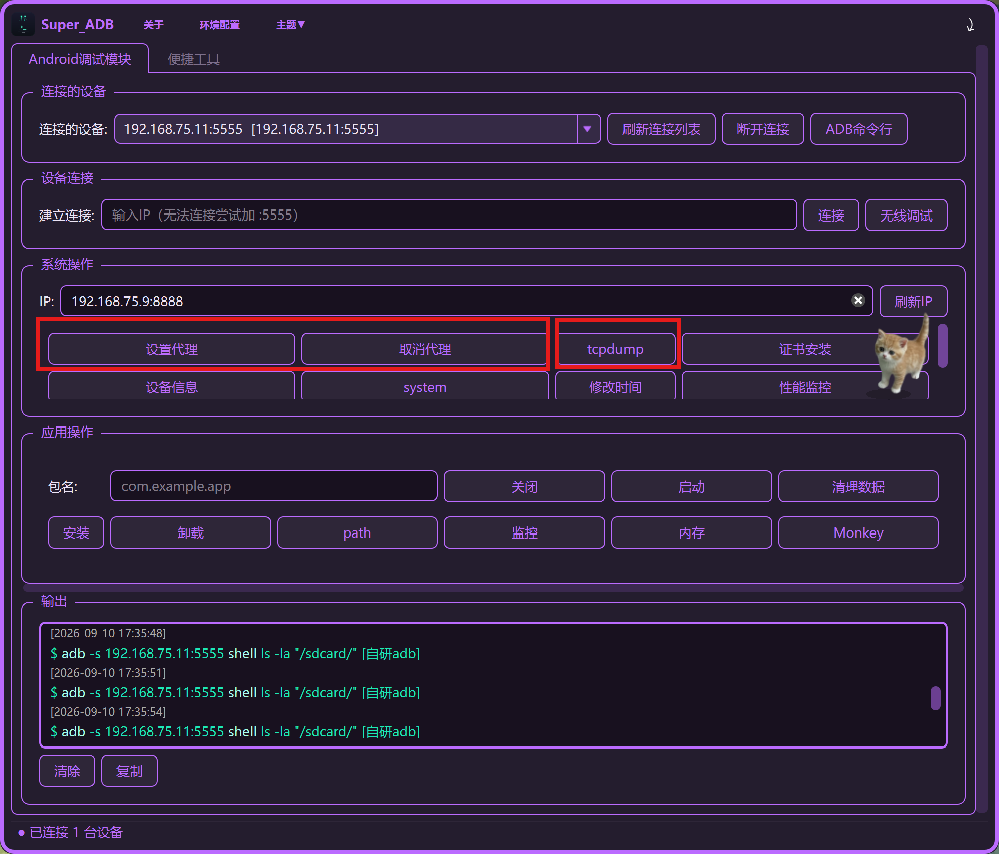
- tcpdump 自动检测架构并推送二进制（arm64/arm），root 设备自动推送
- 自动记录设备是否支持 tcpdump，不重复检测
- BPF 过滤器、实时包数统计、pcap 自动拉取
- PCAP 解析器：HTTP/HTTPS/TCP/UDP 协议分析、流重组
- 代理抓包.你要打开Charles点击设置代理,会将端口指向你电脑的8888端口，点取消代理会清空设备上的代理停止抓取
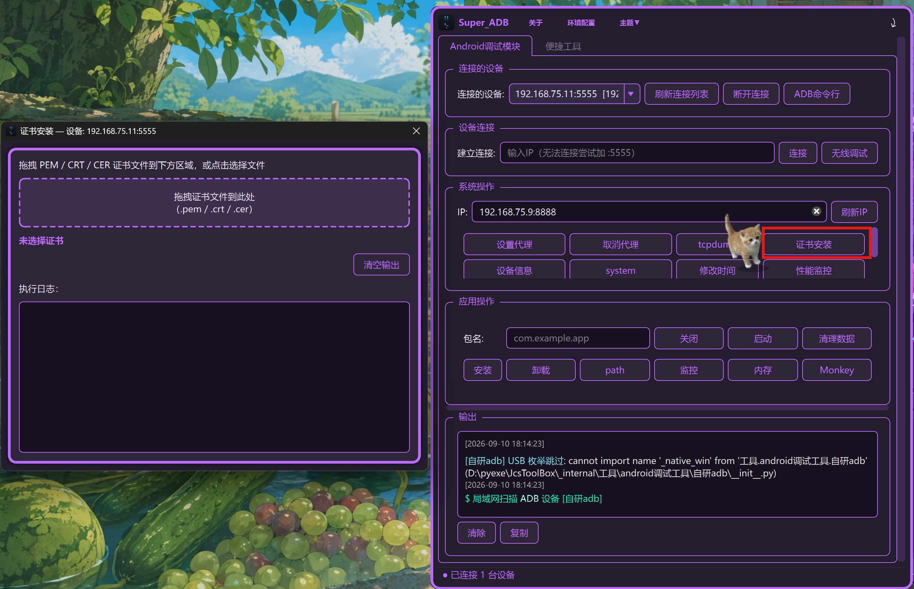
- 证书安装可以把抓包软件的证书编译成设备使用的格式，自动推到设备系统从而实现抓取HTTPS数据(需要root)
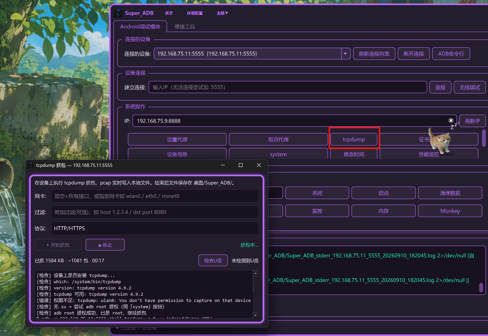
- tcpdump 会使用设备自动的抓包工具抓取数据包( 默认抓http 需要抓tcp udp 可选择抓取范围
- （受设备上自带抓包工具限制范围较大会有丢包情况）)
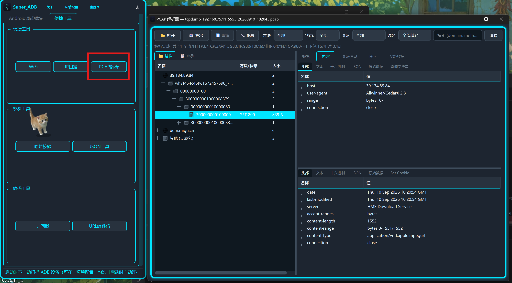
- pcap解析器：HTTP/HTTPS/TCP/UDP 协议分析、流重组  可以把抓到的数据包拖进去解析
### 📺 scrcpy 投屏
- 低延迟投屏，键鼠反向控制
- 智能识别单通道/多通道设备，单通道设备自动切换官方通道，不抢自研连接
- 分辨率/码率/帧率/编码器/渲染驱动自定义
- 文件拖拽传输、屏幕录制

### 🛠️ 便捷工具集
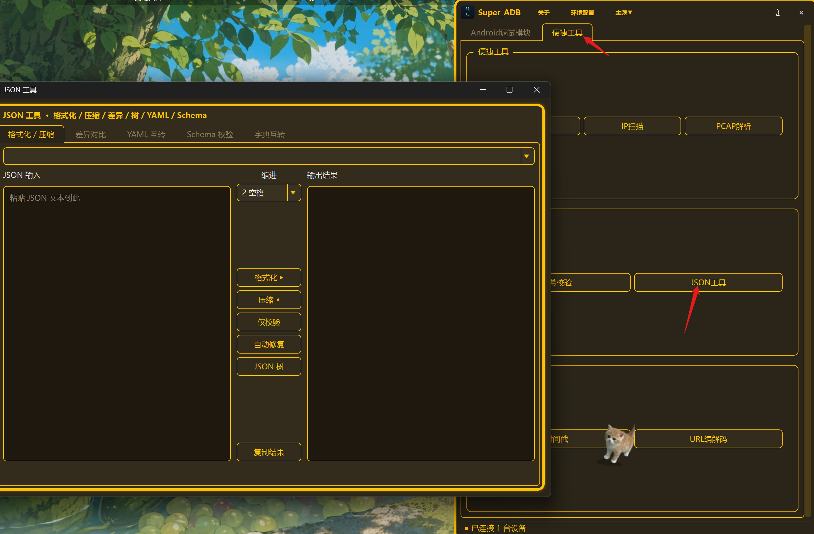
- JSON 工具（格式化/差异对比/YAML 互转/Schema 校验），支持左右拖放 .json 文件对比，导出 HTML 差异报告
- URL 编解码（UTF-8 百分号编码 / 解码）
- 哈希校验（8 种算法，支持 Windows 右键菜单）
- 时间戳转换、修改系统时间、设备信息、证书安装、环境配置

### ⌨️ 系统截图与录屏
- 托盘右键菜单 → 系统截图与录屏，展示本软件截图功能与系统自带截图/录屏检测（每台电脑可能不同）
- **本软件截图**：框选区域后弹出预览工具条，支持矩形/椭圆/箭头/文字标注（可拖动、缩放、改色、撤销），保存/复制到剪贴板
- 本软件截图自动保存到桌面 `Super_ADB/截图/`，可自定义全局热键，热键冲突自动检测，可清空禁用
- **系统截图工具**：自动检测 Win+Shift+S（截图工具）是否可用，显示系统保存位置
- **录屏（系统 Game Bar）**：使用系统自带 Game Bar（Win+Alt+R）录屏，自动检测可用性并显示系统保存位置（默认 `视频/捕获`），点击路径可直接打开目录
- Windows 使用 RegisterHotKey（无需管理员权限），macOS 用 PyObjC NSEvent，Linux 用 python-xlib
- **多主题切换**：共 11 套主题，包含鲜艳彩色、简约纯黑、莫兰迪灰、iOS 深空灰、雾霾蓝等风格，跟随系统记忆选择

### 🐒 Monkey 压测
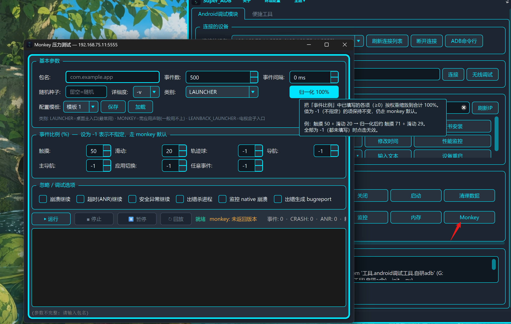
- 命令模板自定义、停止控制、崩溃自动拉取报告
- 实时事件饼图统计、事件回放（支持自研/官网双模式）
- 自动记录设备是否支持 monkey，不重复检测
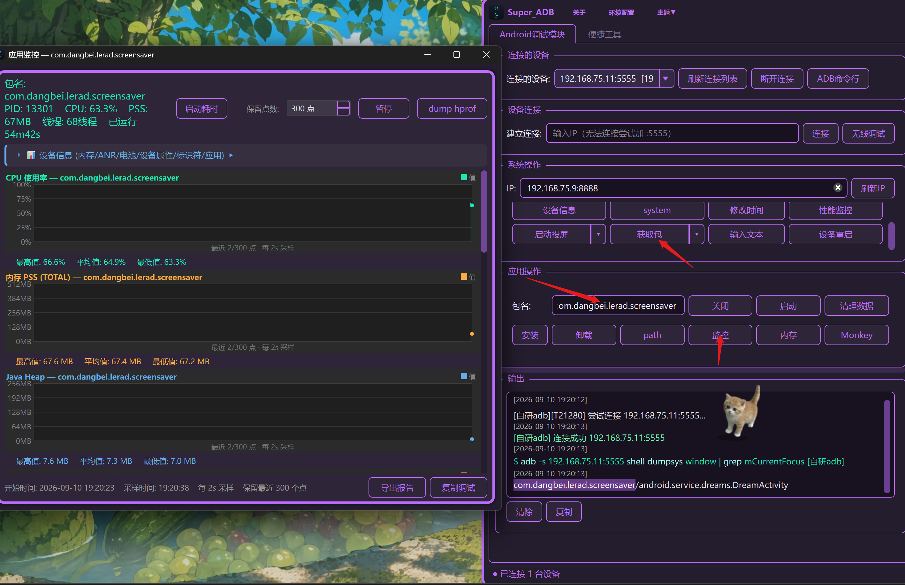
- 搭配应用监控获取性能情况
- 1，点击获取包 可以获取设备界面上正在运行的哪个应用包名/入口
- 2，填入包名，点击监控，就可以监控该应用的性能情况
- 3，点击导出html 会导出html报告到桌面文件夹内

## 🖥️ 支持平台

| 平台 | 目录 | 状态 |
|------|------|------|
| Windows | `Super_ADB_Win/` | ✅ 完整支持 |
| macOS | `Super_ADB_MAC/` | ✅ 完整支持 |
| Linux | `Super_ADB_Linux/` | ✅ 完整支持 |

## 🚀 快速开始

### 环境要求
- Python 3.12+（代码使用了 3.12 的 f-string 反斜杠语法）
- PySide6 等依赖见 [requirements.txt](requirements.txt)

### 源码运行

```bash
# 克隆仓库
git clone https://github.com/Jcs2026-byte/Super_ADB.git
cd Super_ADB

# 安装依赖
pip install -r requirements.txt

# 运行（以 Windows 为例）
cd Super_ADB_Win
python 项目启动入口/Super_ADB_主入口.py
```

### 下载安装包

三平台安装包由 CI（打标签后）自动构建发布，提供两个下载渠道：

- **GitHub Releases**（主选，CI 自动打包）：https://github.com/Jcs2026-byte/Super_ADB/releases
- **Gitee 发行版**（GitHub 跨网不一定能同步过来）：https://gitee.com/Jcs2026/super_adb/releases
- 夸克网盘：https://pan.quark.cn/s/2b7b11ebe1e5?pwd=fAXN#/list/share
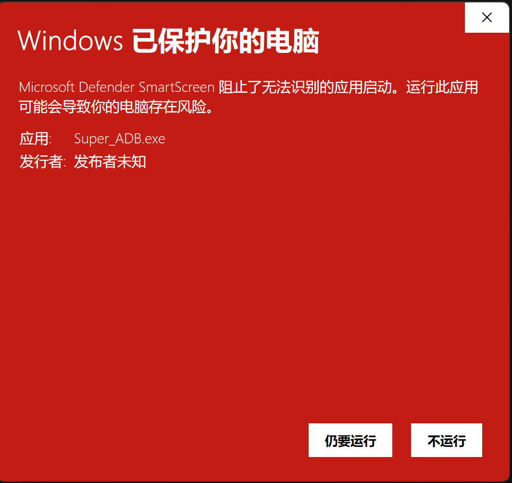
- 安装包是通过 CI 打包的，会被打上网络标签，因为没钱买签名所有第一次运行会提示未知警告，点击允许允许即可，
- 本地打的包不会被打上网络来源标签不会触发警告

解压后找个盘放一下，右击执行文件创建快捷方式放桌面就行

| 平台 | 产物 |
|------|------|
| Linux x86_64 | `Super_ADB-linux-x86_64.tar.gz` |
| Windows x64 | `Super_ADB-windows-x64.zip` |
| macOS arm64 | `Super_ADB-macos-arm64.zip` |

## 📁 项目结构

```
Super_ADB/
├── Super_ADB_Win/          # Windows 平台源码
├── Super_ADB_MAC/          # macOS 平台源码
├── Super_ADB_Linux/        # Linux 平台源码
├── ui/                     # 通用 UI 资源（.ui 设计文件 / 图标 / 编译脚本）
└── .github/                # CI 工作流与打包脚本

三平台目录结构一致，以 Super_ADB_Win 为例：
├── 工具/
│   ├── android调试工具/     # ADB工具、自研adb/（协议栈）、收藏下拉框、性能监控、APK/AXML/DEX 解析
│   ├── 便捷工具/           # JSON读写、WiFi工具、WiFi密码破解、PCAP解析
│   └── 配置/               # Super_ADB配置.json（ADB 模式等运行时配置）
├── 对话框/                 # 各功能对话框（ADB终端、URL编解码、TCPDump、时间戳、设备信息…）
├── 页面/                   # 主界面页面组件
├── 项目UI/                 # 主界面生成代码
├── 项目启动入口/            # 程序入口（Super_ADB_主入口.py）
├── 外部扩展/
│   ├── adb/                # 官方 platform-tools（系统 ADB 模式备用）
│   ├── scrcpy/             # 投屏二进制（各平台发行包，含自带 adb）
│   └── tcpdump/            # 抓包二进制
├── 打包/                   # PyInstaller spec / 构建脚本（build_linux.sh、requirements_*.txt）
├── 脚本/                   # 辅助脚本
├── 诊断/                   # 诊断工具（仅 Windows）
├── 资源/                   # 图标、公众号图等
└── 配置/                   # 顶层运行时配置（仅 Windows）
```

## 📖 文档

- [更新日志](CHANGELOG.md) — 各版本变更记录
- [打包说明](Super_ADB_Linux/打包/README.md) — 三平台打包方法（PyInstaller / build_linux.sh）
- [贡献指南](CONTRIBUTING.md)

## 🔗 开源地址

- **GitHub**：https://github.com/Jcs2026-byte/Super_ADB.git
- **Gitee**：https://gitee.com/Jcs2026/Super_ADB.git

## 🤝 贡献

欢迎提交 Issue 和 Pull Request！请先阅读 [贡献指南](CONTRIBUTING.md)。

## 📜 许可证

本项目基于 [MIT License](LICENSE) 开源。

## 📢 联系方式

扫码关注公众号 **Super_ADB**，获取最新版本更新、使用教程和技术分享。


