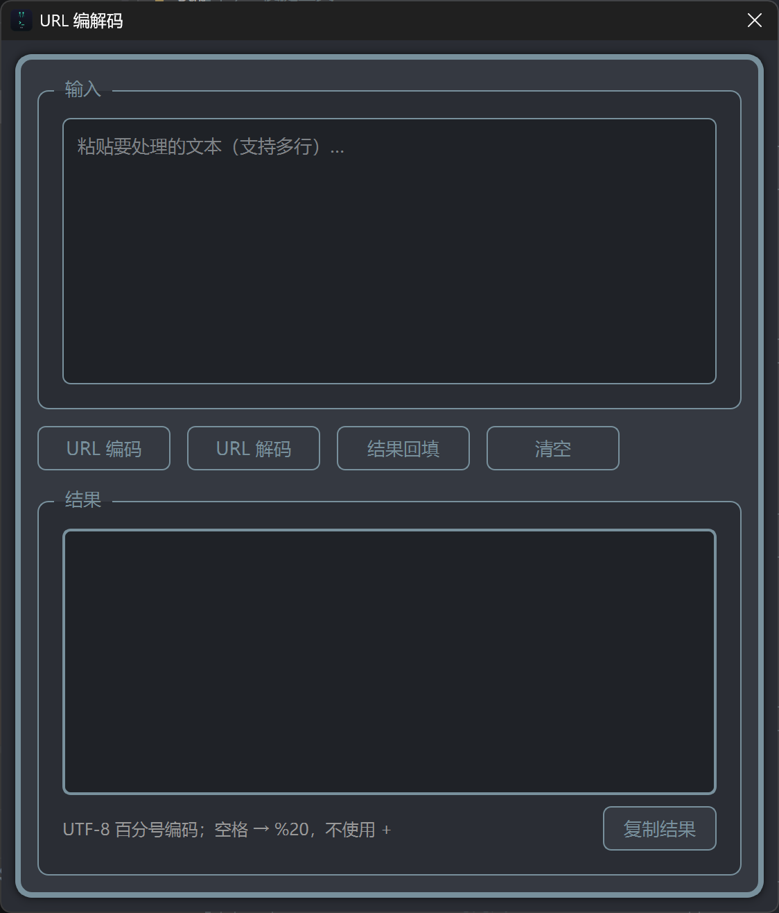

# 功能详解

## 🔌 设备连接

### 自研 ADB（默认）
纯 Python 实现的 ADB 协议栈，位于 `工具/android调试工具/自研adb/`：
- TCP 直连设备 5555 / 随机调试端口
- USB 连接（pyusb）
- 不依赖官方 adb server，不占用 5037 端口
- 类级连接缓存：同一设备只做一次 AUTH 建连，多窗口共享

### 无线调试
三种连接方式：
- **局域网扫描**：自动发现局域网内开启无线调试的设备
- **配对码连接**：adb pair 配对流程
- **二维码连接**：mDNS 发现，扫码即连

### 系统 ADB / Socket 直连
可一键切换回官方 adb（PATH 或内置 platform-tools），适配特殊环境。

## 📁 文件管理

- 设备文件树浏览器，支持上传/下载/删除/重命名/移动/新建目录/新建文件
- 拖拽上传、深度递归搜索、文本/图片/视频预览
- 双击文本文件在线编辑，保存自动回传设备（缓存到桌面 Super_ADB/文件缓存/）
- 深度搜索结果右键"打开所在路径"，自动定位展开到目标目录
- 权限修改（右键授权 777）
- 只读分区自动检测并附解锁引导
- 切换 ADB 模式时自动停止正在进行的文件管理/日志任务

## 📦 应用管理

- APK 拖拽安装、批量安装、实时进度显示
- APK 元信息解析（包名/版本/权限/四大组件）
- 解包查看资源
- 安装失败自动诊断原因
- 包信息获取：安装路径/PID/版本/SDK/UID/数据目录/应用大小

## 📋 日志抓取

- 多标签 logcat 查看器，实时流式输出
- 关键字过滤（支持正则）、日志级别筛选、星标标记
- 多设备同时监控
- 日志导出保存到桌面 Super_ADB/日志/

## 📊 性能监控

- **设备级**：CPU 多核分核 / 内存 / 温度 / FPS / 网络速率
- **应用级**：12 项图表指标、内存泄漏自动检测、ANR/OOM 检测、hprof 自动抓取
- HTML 报告导出，数据实时刷新

## 🌐 网络抓包

- tcpdump 自动检测架构并推送二进制（arm64/arm）
- BPF 过滤器、实时包数统计、pcap 自动拉取
- PCAP 解析器：HTTP/HTTPS/TCP/UDP 协议分析、流重组

- 代理抓包 + HTTPS 证书安装（需 root）

## 📺 scrcpy 投屏

- 低延迟投屏，键鼠反向控制
- 分辨率/码率/帧率/编码器/渲染驱动自定义
- 文件拖拽传输、屏幕录制

## 🛠️ 便捷工具集

- **ADB 终端**：命令历史、常用命令快捷按钮、ANSI 过滤

- **JSON 工具**：格式化 / 差异对比（左右拖放）/ YAML 互转 / Schema 校验 / HTML 差异报告导出
- **URL 编解码**：UTF-8 百分号编码 / 解码

- **哈希校验**：8 种算法，支持 Windows 右键菜单
- **时间戳转换**、**修改系统时间**、**设备信息**、**证书安装**、**环境配置**

## ⌨️ 全局快捷键

- 托盘右键菜单 → 快捷键配置，支持自定义截屏/录屏热键
- **截图**：框选区域后弹出预览，支持矩形/椭圆/箭头/文字标注（可拖动、缩放、改色、撤销）
- 截图保存到 `桌面/Super_ADB/截图/`，录屏保存到 `Super_ADB/录屏/`
- 热键冲突自动检测，可清空禁用
- Windows: RegisterHotKey；macOS: PyObjC NSEvent；Linux: python-xlib

## 🐒 Monkey 压测

- 命令模板自定义、暂停/继续/停止控制
- 实时事件饼图统计
- 崩溃报告自动拉取、事件回放
